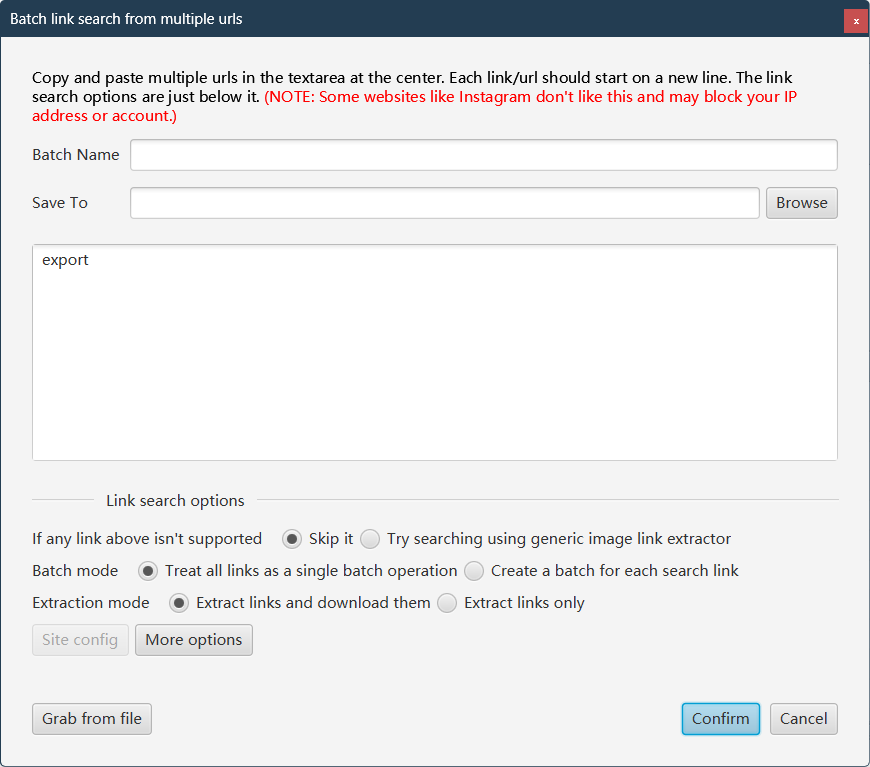

# wfilter

Download [WFDownloader](https://www.wfdownloader.xyz/download)

[How to](https://www.wfdownloader.xyz/blog/twitter-downloader-for-images-and-videos)

## Usage

1. Fetch for export (WFDownloader 0.87)

    

    Export to export.json

2. Get all tweet urls

    ```shell
    python main.py -f export.json
    ```

3. Batch links search from multiple urls (WFDownloader)

    

    More Options -> Delay each download > 5s

4. Rename with date

    ```shell
    python main.py -f export.json -i /path/save
    ```
